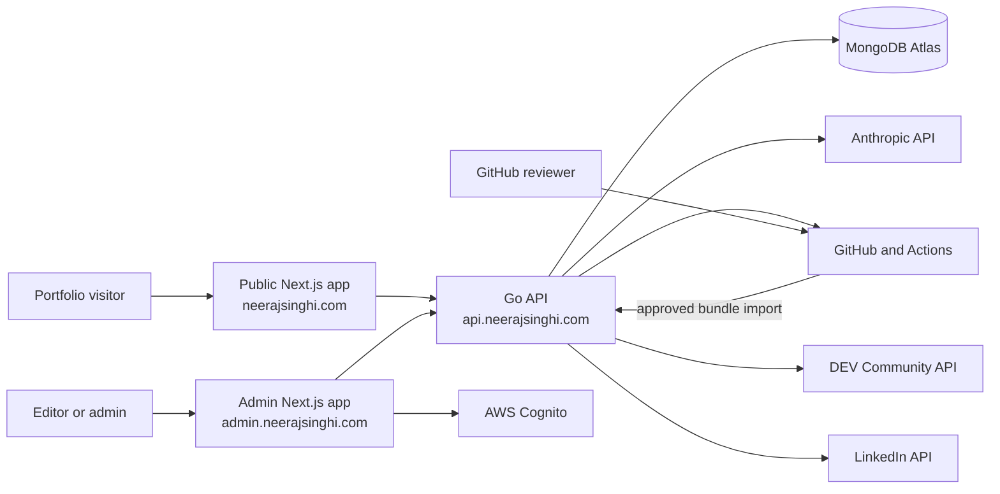
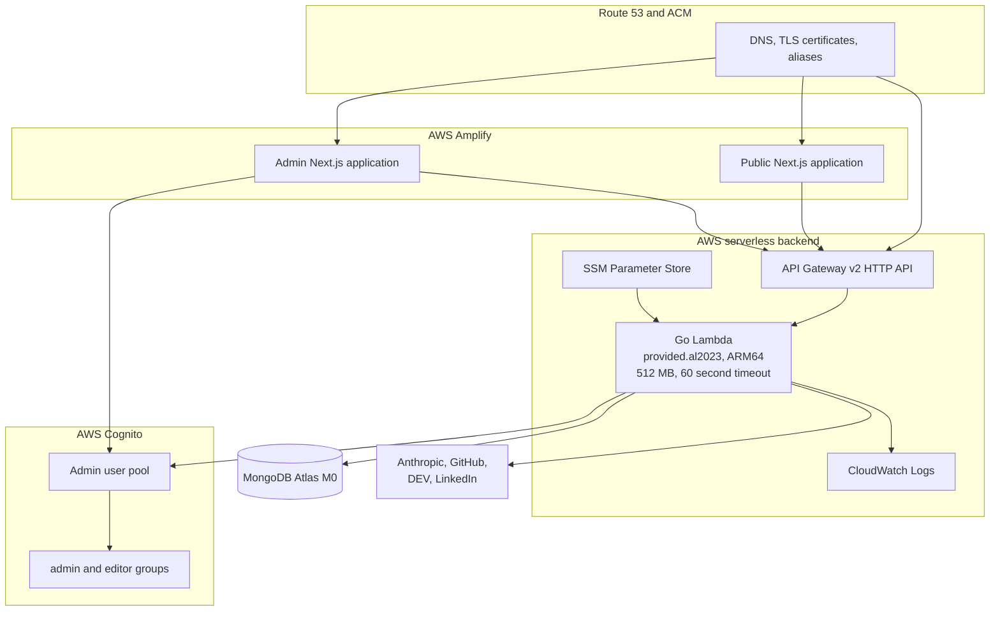
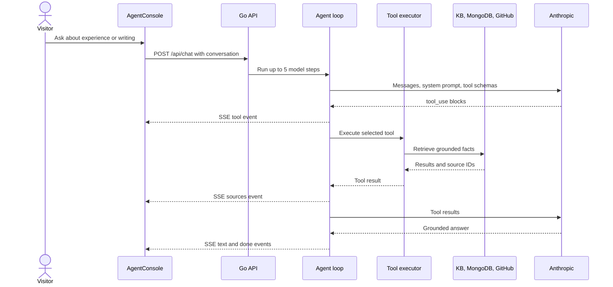
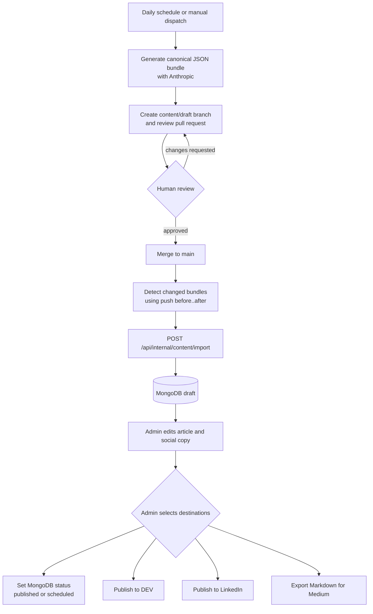
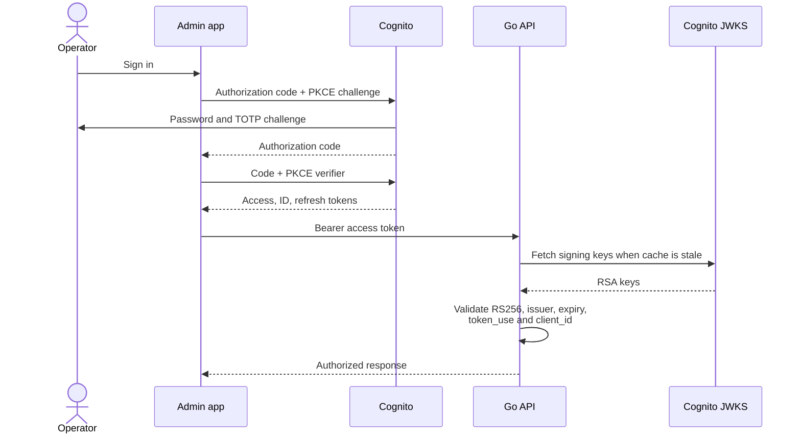
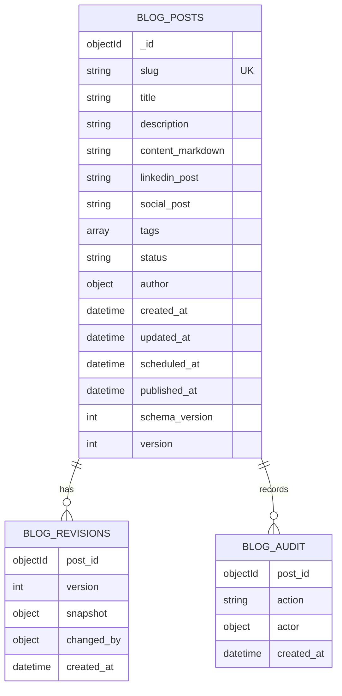
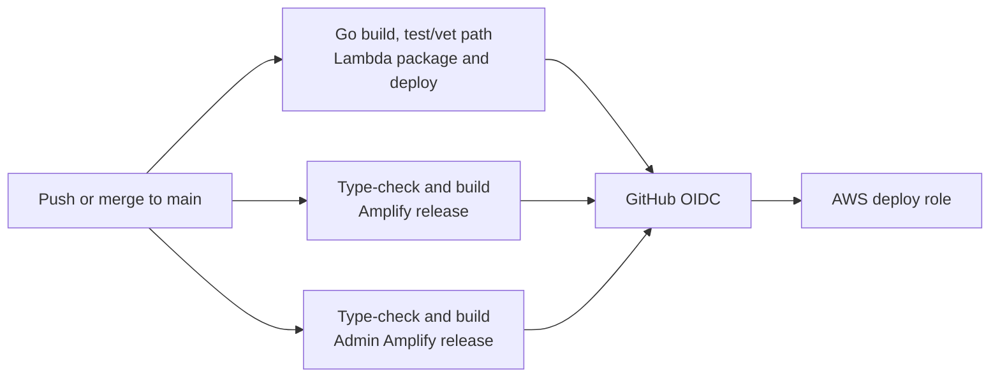
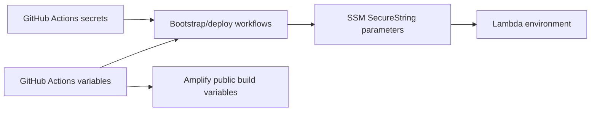

# Neeraj Portfolio System Design

- **Status:** As built
- **Last updated:** 2026-08-10
- **Production region:** `ap-south-1`
- **Primary domains:** `neerajsinghi.com`, `admin.neerajsinghi.com`, `api.neerajsinghi.com`

## 1. Purpose

This system serves four related capabilities:

1. A public portfolio and blog for recruiters, engineers, and potential clients.
2. A grounded AI assistant that answers questions about Neeraj's experience, projects, services, and published writing.
3. A private editorial console for reviewing, editing, scheduling, and publishing articles.
4. An approval-first content pipeline that generates technical drafts, opens pull requests, imports merged drafts into the CMS, and syndicates approved content.

The production architecture is intentionally serverless and optimized for low traffic and a monthly infrastructure target below approximately USD 5. The optional EKS stack is retained for future use but is not part of the budget production path.

## 2. Design Goals

- Keep the public site fast and independently deployable.
- Keep LLM and publishing credentials on the server.
- Ground AI answers in curated profile data and published articles.
- Require human approval before generated content enters the CMS.
- Require a second admin decision before public publication.
- Provide editor/admin separation, audit records, revisions, and optimistic concurrency.
- Avoid always-on compute, NAT gateways, and paid database tiers at low traffic.
- Support local development with Docker Compose.

## 3. System Context

## 4. Production Container View

### Component responsibilities

| Component           | Responsibility                                                              | Deployment                                   |
| ------------------- | --------------------------------------------------------------------------- | -------------------------------------------- |
| Public frontend     | Portfolio sections, blog pages, GitHub strip, SSE agent console             | Separate Amplify app                         |
| Admin frontend      | Cognito login, draft list, editor, preview, schedule, destination selection | Separate Amplify app with `noindex` metadata |
| API Gateway         | Public HTTPS entry point and custom domain mapping                          | HTTP API with `$default` stage               |
| Go Lambda           | HTTP routes, agent loop, Cognito validation, blog operations, syndication   | Custom `provided.al2023` ARM64 runtime       |
| Cognito             | Authorization code with PKCE, TOTP MFA, groups and tokens                   | User pool, app client, hosted domain         |
| MongoDB Atlas       | Blog posts, revisions, and audit records                                    | Atlas M0, accessed over TLS                  |
| GitHub Actions      | CI/CD, daily generation, review PRs, approved-draft imports                 | OIDC authentication to AWS                   |
| SSM Parameter Store | Backend runtime secrets and configuration                                   | `/neeraj-portfolio/*` parameters             |

## 5. Public Request Flows

### 5.1 Portfolio and blog

1. Amplify serves the public Next.js application.
2. Browser-side API calls use `NEXT_PUBLIC_API_BASE`.
3. `GET /api/blogs` returns summaries for posts that are public now.
4. `GET /api/blogs/{slug}` returns Markdown for one public post.
5. A post is public when its status is `published`, or when it is `scheduled` and `scheduled_at <= now`.

Scheduled publication does not require a cron job. The public MongoDB query evaluates the schedule at read time.

### 5.2 Grounded agent chat

The agent is provider-agnostic through `llm.Provider`, although production currently wires Anthropic. Its maximum is five model steps per request and 1,000 output tokens per step. The tool set includes:

- TF-IDF retrieval over the embedded profile corpus.
- Published blog listing and topic search from MongoDB.
- Grounded projects, services, skills, education, certifications, and experience.
- Live GitHub repository retrieval with an in-memory cache.

The browser receives tool names and source IDs, but never provider credentials.

## 6. Editorial and Content Lifecycle

The system intentionally has two human approval gates:

1. **Git approval:** approve and merge generated source content into the repository.
2. **Editorial approval:** edit and publish the imported MongoDB draft from the admin console.

### 6.1 Generation

- `.github/workflows/content-draft.yml` runs daily at `02:30 UTC` or on manual dispatch.
- A day-of-year rotation selects one of 14 backend-heavy editorial pillars.
- Titles from the previous 90 days are included as anti-duplication context.
- `go run ./cmd/content generate` requests a 1,200 to 1,800 word article plus LinkedIn and short social adaptations.
- The Anthropic HTTP timeout is 180 seconds in CI.
- Generation retries at most three times, with 15 and 30 second delays.
- The result is committed under `content/drafts/YYYY-MM-DD.json` and proposed in a pull request.

### 6.2 Merge-to-CMS import

- `.github/workflows/content-import.yml` runs on a push to `main` that changes `content/drafts/**.json`.
- It compares `github.event.before` with `GITHUB_SHA`, which works for merge commits and direct pushes.
- Each changed bundle is sent to `/api/internal/content/import` with a dedicated bearer token.
- The API performs a constant-time token comparison.
- Bundle fields are mapped to a `blog.WriteInput` and status is forced to `draft` regardless of input.
- A unique slug makes repeated workflow runs idempotent. An existing slug returns `200` with `imported: false`.

### 6.3 Admin review and publishing

- Editors can create and modify drafts.
- Admins can publish, schedule, archive, delete, and syndicate.
- Updates require the current `version`, providing optimistic concurrency control.
- Publishing to the personal site is a MongoDB status update.
- Publishing to DEV or LinkedIn calls `/api/admin/publish` with the selected external platforms.
- External posts use `https://neerajsinghi.com/blogs/{slug}` as the canonical URL.
- Medium is a Markdown export because there is no supported new-integration publishing API.

Personal-site publication and external syndication are separate operations. The admin UI performs them sequentially, but there is no distributed transaction. If a later external call fails, earlier publication may already have succeeded and must be inspected before retrying.

## 7. Backend API

All routes are versioned under `/api/v1/...`. The previous unversioned `/api/...` paths are kept as backward-compatible aliases handled by the same code, so existing integrations continue to work without change. Every response includes an `X-API-Version` header, and `GET /api/v1/health` reports `api_version` in its body.

| Method   | Route                                | Legacy alias                   | Authorization       | Purpose                                              |
| -------- | ------------------------------------- | ------------------------------- | ------------------- | ---------------------------------------------------- |
| `GET`    | `/api/v1/health`                      | `/api/health`                   | Public              | Runtime and dependency readiness flags, plus `api_version` |
| `POST`   | `/api/v1/chat`                        | `/api/chat`                     | Public              | SSE agent conversation                               |
| `GET`    | `/api/v1/github`                      | `/api/github`                   | Public              | Portfolio repository feed                            |
| `GET`    | `/api/v1/blogs`                       | `/api/blogs`                    | Public              | Published/scheduled blog summaries                   |
| `GET`    | `/api/v1/blogs/{slug}`                | `/api/blogs/{slug}`             | Public              | Published/scheduled blog body                        |
| `GET`    | `/api/v1/admin/blogs`                 | `/api/admin/blogs`              | Editor or admin     | List every post state                                |
| `POST`   | `/api/v1/admin/blogs`                 | `/api/admin/blogs`              | Editor or admin     | Create a draft; non-draft create requires admin      |
| `PUT`    | `/api/v1/admin/blogs/{id}`            | `/api/admin/blogs/{id}`         | Editor or admin     | Edit with version check; state changes require admin |
| `DELETE` | `/api/v1/admin/blogs/{id}`            | `/api/admin/blogs/{id}`         | Admin               | Permanently delete a post                            |
| `POST`   | `/api/v1/admin/publish`               | `/api/admin/publish`            | Admin               | Publish supplied content to DEV/LinkedIn             |
| `POST`   | `/api/v1/internal/content/import`     | `/api/internal/content/import`  | Import bearer token | Import a generated bundle as a draft                 |

All blog handlers use a five-second operation context. External publication has a 45-second aggregate context. Request bodies are limited to 1 MiB and reject unknown JSON fields.

### 7.1 Versioning policy

- `v1` is the current and only supported version; the version segment exists so a future breaking change can ship as `/api/v2/...` without touching `v1` behavior.
- The unversioned legacy aliases are not deprecated on a fixed timeline; they route to the exact same handlers as `v1` and carry no independent behavior.
- Frontend (`frontend/lib/api.ts`, `frontend/lib/blogs.ts`), admin (`admin/lib/api.ts`), and the content-import workflow (`.github/workflows/content-import.yml`) call `/api/v1/...` directly.
- A [Postman collection](../postman/neeraj-portfolio-api.postman_collection.json) with local and production environments (`postman/`) exercises every route above, including the admin and internal (machine) authorization flows.

## 8. Authentication and Authorization

### 8.1 Browser login

### 8.2 RBAC matrix

| Capability              | Public | Editor | Admin |  Import workflow  |
| ----------------------- | :----: | :----: | :---: | :---------------: |
| Read published blogs    |  Yes   |  Yes   |  Yes  |        No         |
| List all post states    |   No   |  Yes   |  Yes  |        No         |
| Create/edit draft       |   No   |  Yes   |  Yes  |        No         |
| Publish or schedule     |   No   |   No   |  Yes  |        No         |
| Archive/delete          |   No   |   No   |  Yes  |        No         |
| Publish to DEV/LinkedIn |   No   |   No   |  Yes  |        No         |
| Import generated bundle |   No   |   No   |  No   | Yes, forced draft |

Cognito requires TOTP MFA, a 14-character password with complexity, admin-created accounts, one-hour access/ID tokens, seven-day refresh tokens, and token revocation support. JWKS keys are cached in Lambda memory for six hours.

## 9. Data Design

### Indexes

| Collection       | Index                              | Purpose                                     |
| ---------------- | ---------------------------------- | ------------------------------------------- |
| `blog_posts`     | unique `{slug: 1}`                 | Stable canonical URL and import idempotency |
| `blog_posts`     | `{status: 1, published_at: -1}`    | Public feed                                 |
| `blog_posts`     | `{status: 1, scheduled_at: 1}`     | Scheduled visibility query                  |
| `blog_revisions` | unique `{post_id: 1, version: -1}` | One immutable snapshot per version          |

The MongoDB client uses a maximum pool size of five, zero minimum connections, a 30-second idle timeout, five-second connection/server-selection timeouts, and a 15-second socket timeout. This limits connection pressure from reused Lambda execution environments.

## 10. Deployment and Configuration

### 10.1 CI/CD

- Backend changes build a root-level `bootstrap` binary for Linux ARM64 and update Lambda.
- Frontend and admin changes run type checks and production builds before starting Amplify release jobs.
- AWS access uses short-lived GitHub OIDC credentials. Long-lived AWS access keys are not required by CI.
- Amplify auto-build is disabled; GitHub Actions starts explicit releases.
- Terraform state is encrypted in S3 and uses S3 lockfile-based locking.

### 10.2 Runtime configuration flow

Secret examples include provider API keys, MongoDB URI, import token, and publishing tokens. Public build variables include API base URLs and Cognito client configuration. Secrets must not be placed in `NEXT_PUBLIC_*` values or committed Terraform values.

## 11. Local Development

Docker Compose provides:

- MongoDB 7 on `127.0.0.1:27017` with a persistent volume and health check.
- Go backend on port `8080`.
- Optional public frontend profile on port `3000`.
- Optional admin profile on port `3200`.

The backend receives local MongoDB and CORS settings from Compose. Admin authentication still requires valid Cognito public client settings unless a test authenticator is injected in backend tests.

## 12. Reliability and Failure Behavior

| Failure                            | Current behavior                                                                                           | Recovery                                                           |
| ---------------------------------- | ---------------------------------------------------------------------------------------------------------- | ------------------------------------------------------------------ |
| MongoDB unavailable at cold start  | Blog store remains unconfigured; blog/admin routes return `503`; non-blog agent functions remain available | Fix Atlas/network credentials and allow a fresh Lambda environment |
| Cognito initialization unavailable | Admin routes return `503`; public routes continue                                                          | Fix Cognito configuration and redeploy/recycle Lambda              |
| Invalid/expired admin token        | API returns `401`                                                                                          | Admin signs in or refreshes session                                |
| Concurrent article edit            | Version mismatch returns `409`                                                                             | Reload latest post and reapply edit                                |
| Duplicate content import           | Unique slug conflict becomes successful no-op                                                              | No action required                                                 |
| Anthropic generation latency       | 180-second CI timeout and three bounded attempts                                                           | Workflow fails visibly after final attempt                         |
| Import transient failure           | `curl` retries three times                                                                                 | Rerun import workflow; operation is idempotent                     |
| Merge file detection regression    | Path-triggered import fails instead of falsely succeeding                                                  | Inspect workflow and manually dispatch the bundle                  |
| DEV/LinkedIn failure               | API returns `502`; prior destinations may already be public                                                | Inspect platform state before retrying                             |
| GitHub repository API failure      | Repository strip/tool can return an error while the rest of the API remains usable                         | Wait for cache/rate limit recovery                                 |

## 13. Scaling and Cost Model

### Current budget mode

- Lambda and API Gateway scale to zero and charge per use.
- Amplify charges for builds, hosting, transfer, and any SSR compute used by Next.js.
- MongoDB Atlas M0 has no database charge within free-tier limits.
- Cognito is expected to stay inside its free allowance for a very small admin user set.
- SSM standard parameters, Route 53, domain registration, CloudWatch logs, and data transfer can still produce small charges.
- Lambda remains outside a VPC, avoiding NAT Gateway hourly charges.
- ARM64 and a 512 MB memory setting reduce Lambda cost at this workload size.

### Scale-up path

1. Increase Lambda memory if LLM request handling or Markdown operations become CPU constrained.
2. Add reserved concurrency to protect upstream APIs and MongoDB connection limits.
3. Upgrade Atlas when storage, connections, backups, or performance exceed M0 limits.
4. Add structured metrics, alarms, and tracing before materially increasing traffic.
5. Use the optional VPC/ECR/EKS modules only when workload requirements justify their fixed baseline cost.

## 14. Security Model

### Controls present

- TLS at all public domains.
- Cognito authorization code flow with PKCE and mandatory TOTP.
- Server-side JWT verification with algorithm, issuer, expiry, token type, and client checks.
- Editor/admin role enforcement in the backend, not only the UI.
- Dedicated content-import token with constant-time comparison.
- Forced `draft` status for machine imports.
- CORS allowlist for public and admin origins.
- 1 MiB JSON body limit and unknown-field rejection.
- MongoDB author attribution, revisions, audit entries, and optimistic locking.
- GitHub Actions OIDC for AWS deployment.
- Public blog responses omit author identity.

### Required remediation

The tracked `infrastructure/terraform/terraform.tfvars` currently contains a GitHub personal access token. Treat it as compromised:

1. Revoke and rotate the token in GitHub immediately.
2. Remove the value from the tracked file and use a secure input mechanism.
3. Purge it from Git history if the repository or any clone has been shared.
4. Prefer a GitHub App or Amplify repository connection over a broad personal token.

### Known security and operational gaps

- The external publish endpoint accepts article content from the authenticated admin request rather than loading a saved post by ID.
- External publication results are returned but are not persisted as per-platform publication records.
- Syndication is not transactional and has no automatic compensation.
- There is no explicit application-level rate limit on public chat.
- Chat uses the Lambda request lifetime and does not set its own context deadline.
- Atlas serverless access requires public egress network policy because Lambda has no fixed outbound IP.
- Audit writes are best effort; a successful post operation can outlive a failed audit insert.

## 15. Key Decisions and Tradeoffs

| Decision                           | Benefit                                         | Tradeoff                                                |
| ---------------------------------- | ----------------------------------------------- | ------------------------------------------------------- |
| Lambda/API Gateway instead of EKS  | Near-zero idle cost and low operations burden   | Cold starts, execution timeout, changing egress IPs     |
| Separate public/admin Amplify apps | Independent access and deployment boundaries    | Two build/deploy pipelines                              |
| MongoDB Atlas M0                   | No baseline database cost                       | Shared-tier limits and public serverless connectivity   |
| Embedded TF-IDF profile RAG        | Deterministic, cheap, no vector service         | Corpus updates require a backend deployment             |
| Live MongoDB blog retrieval        | Agent answers reflect current published writing | Search is lexical and scans a bounded post set          |
| PR review before CMS import        | Versioned human approval and traceability       | Additional workflow latency                             |
| Separate CMS publication gate      | Prevents merge from becoming public publication | Two approvals are required                              |
| Read-time scheduled visibility     | No scheduler infrastructure                     | Publication changes only when a reader requests data    |
| Direct external API calls          | Simple and inexpensive                          | Partial success and token-expiry handling remain manual |

## 16. Source Map

| Concern                          | Primary implementation                                |
| -------------------------------- | ----------------------------------------------------- |
| HTTP routes and dependency setup | `backend/internal/server/http.go`                     |
| Blog handlers and publishing     | `backend/internal/server/blog.go`                     |
| Blog model and RBAC              | `backend/internal/blog/model.go`                      |
| MongoDB store and indexes        | `backend/internal/blog/store.go`                      |
| Cognito JWT verification         | `backend/internal/auth/cognito.go`                    |
| Agent loop                       | `backend/internal/agent/agent.go`                     |
| Tool registry and execution      | `backend/internal/tools/tools.go`                     |
| Embedded profile retrieval       | `backend/internal/kb/kb.go`                           |
| Content generation               | `backend/internal/content/content.go`                 |
| DEV and LinkedIn clients         | `backend/internal/publisher/publisher.go`             |
| Admin orchestration              | `admin/components/AdminDashboard.tsx`                 |
| Daily generation workflow        | `.github/workflows/content-draft.yml`                 |
| Merge-to-CMS import              | `.github/workflows/content-import.yml`                |
| AWS root composition             | `infrastructure/terraform/main.tf`                    |
| Lambda/API Gateway               | `infrastructure/terraform/modules/lambda_api/main.tf` |
| Cognito                          | `infrastructure/terraform/modules/cognito/main.tf`    |
| Amplify apps                     | `infrastructure/terraform/modules/amplify/main.tf`    |

## 17. Recommended Next Improvements

1. Rotate and remove the committed GitHub PAT before further feature work.
2. Persist platform publication records with status, remote ID, URL, attempt time, and idempotency key.
3. Change external publishing to accept a post ID and load the canonical saved version server-side.
4. Add chat rate limiting and request-scoped cancellation/deadlines.
5. Add CloudWatch alarms for Lambda errors, latency, throttles, and import workflow failures.
6. Add an admin publication history view and explicit retry controls per destination.
7. Add integration tests for merge import, scheduled visibility, and partial syndication failure.
